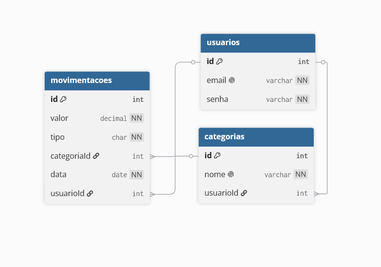

# API Controle de Finanças

Um sistema simples de controle de movimentações bancárias para estudo da implementação de uma API Restful em ASP.NET

**Funcionamento:** O usuário registra suas movimentações de receita e despesa por dia. O sistema consegue retornar esses dados e fazer um cálculo total do valor de despesas e de receita.

## Diagrama do DB



---

## Como Rodar

### Desenvolvimento

**Pré-requisitos:**
- [.NET 10 SDK](https://dotnet.microsoft.com/download)
- [Docker](https://www.docker.com/) (para o banco de dados)

**1. Suba o banco de dados PostgreSQL:**

```bash
docker run -d \
  --name controle-financeiro-db \
  -e POSTGRES_DB=controleFinanceiroDb \
  -e POSTGRES_USER=postgres \
  -e POSTGRES_PASSWORD=postgres \
  -p 5432:5432 \
  postgres:16
```

**2. Gere a chave JWT com OpenSSL:**

```bash
openssl rand -base64 32
```

**3. Configure os User Secrets:**

```bash
dotnet user-secrets init
dotnet user-secrets set "Jwt:Key" "sua-chave-gerada-no-passo-anterior"
```

**4. Rode a aplicação:**

```bash
dotnet run
```

A API estará disponível em `http://localhost:5096`.

---

### Produção (Docker Compose)

**1. Gere a chave JWT com OpenSSL:**

```bash
openssl rand -base64 32
```

**2. Crie o arquivo `.env` na raiz do projeto:**

```env
JWT_KEY=sua-chave-gerada-no-passo-anterior
POSTGRES_DB=controleFinanceiroDb
POSTGRES_USER=postgres
POSTGRES_PASSWORD=sua-senha-segura
```

**3. Suba os containers:**

```bash
docker compose up -d
```

A API estará disponível em `http://localhost:8080`.

---

## Endpoints da API

> Todos os endpoints, exceto `/api/auth`, requerem autenticação via Bearer Token no header:
> 
> **Authorization: Bearer {token}**
> 

---

### Auth

#### POST /api/auth/registrar

```json
{
  "email": "usuario@email.com",
  "senha": "sua-senha"
}
```

**Response (200 OK)**

```json
{
  "token": "eyJhbGciOiJIUzI1NiIsInR5cCI6IkpXVCJ9..."
}
```

#### POST /api/auth/login

```json
{
  "email": "usuario@email.com",
  "senha": "sua-senha"
}
```

**Response (200 OK)**

```json
{
  "token": "eyJhbGciOiJIUzI1NiIsInR5cCI6IkpXVCJ9..."
}
```

---

### Categorias

#### POST /api/categoria

```json
{
  "nome": "Alimentação"
}
```

**Response (201 Created)**

```json
{
  "id": 1,
  "nome": "Alimentação"
}
```

#### GET /api/categoria

**Response (200 OK)**

```json
[
  {
    "id": 1,
    "nome": "Alimentação"
  },
  {
    "id": 2,
    "nome": "Transporte"
  }
]
```

#### GET /api/categoria/{id}

**Response (200 OK)**

```json
{
  "id": 1,
  "nome": "Alimentação"
}
```

**Response (404 Not Found)**

```json
{
  "mensagem": "Categoria não encontrada"
}
```

#### PATCH /api/categoria/{id}

```json
{
  "nome": "Supermercado"
}
```

**Response (200 OK)**

```json
{
  "id": 1,
  "nome": "Supermercado"
}
```

**Response (404 Not Found)**

```json
{
  "mensagem": "Categoria não encontrada"
}
```

#### DELETE /api/categoria/{id}

**Response (204 No Content)**

**Response (404 Not Found)**

```json
{
  "mensagem": "Categoria não encontrada"
}
```

---

### Movimentações

#### POST /api/movimentacao

```json
{
  "valor": 12.0,
  "tipo": "Despesa",
  "categoriaId": 1,
  "data": "2026-06-19"
}
```

**Response (201 Created)**

```json
{
  "id": 1,
  "valor": 12.0,
  "tipo": "Despesa",
  "categoriaId": 1,
  "data": "2026-06-19"
}
```

**Response (400 Bad Request)**

```json
{
  "mensagem": "Categoria informada não existe"
}
```

#### GET /api/movimentacao

**Response (200 OK)**

```json
[
  {
    "id": 1,
    "valor": 12.0,
    "tipo": "Despesa",
    "categoriaId": 1,
    "data": "2026-06-19"
  },
  {
    "id": 2,
    "valor": 1500.0,
    "tipo": "Receita",
    "categoriaId": 2,
    "data": "2026-06-20"
  }
]
```

#### GET /api/movimentacao?tipo=Despesa

```json
[
  {
    "id": 1,
    "valor": 12.0,
    "tipo": "Despesa",
    "categoriaId": 1,
    "data": "2026-06-19"
  }
]
```

#### GET /api/movimentacao?categoriaId=1

```json
[
  {
    "id": 1,
    "valor": 12.0,
    "tipo": "Despesa",
    "categoriaId": 1,
    "data": "2026-06-19"
  }
]
```

#### GET /api/movimentacao?data=2026-06-19

```json
[
  {
    "id": 1,
    "valor": 12.0,
    "tipo": "Despesa",
    "categoriaId": 1,
    "data": "2026-06-19"
  }
]
```

#### GET /api/movimentacao/{id}

**Response (200 OK)**

```json
{
  "id": 1,
  "valor": 12.0,
  "tipo": "Despesa",
  "categoriaId": 1,
  "data": "2026-06-19"
}
```

**Response (404 Not Found)**

```json
{
  "mensagem": "Movimentação não encontrada"
}
```

#### DELETE /api/movimentacao/{id}

**Response (204 No Content)**

**Response (404 Not Found)**

```json
{
  "mensagem": "Movimentação não encontrada"
}
```

---

### Relatórios

#### GET /api/relatorio/saldo

**Response (200 OK)**

```json
{
  "saldo": 1387.5
}
```

**Regra:**

```
saldo = soma(receitas) - soma(despesas)
```

#### GET /api/relatorio/resumo

**Response (200 OK)**

```json
{
  "totalReceitas": 2000.0,
  "totalDespesas": 612.5,
  "saldo": 1387.5
}
```

#### GET /api/relatorio/total-categoria

**Response (200 OK)**

```json
[
  {
    "categoria": "Alimentação",
    "total": 320.0
  },
  {
    "categoria": "Transporte",
    "total": 150.0
  },
  {
    "categoria": "Lazer",
    "total": 80.0
  }
]
```
